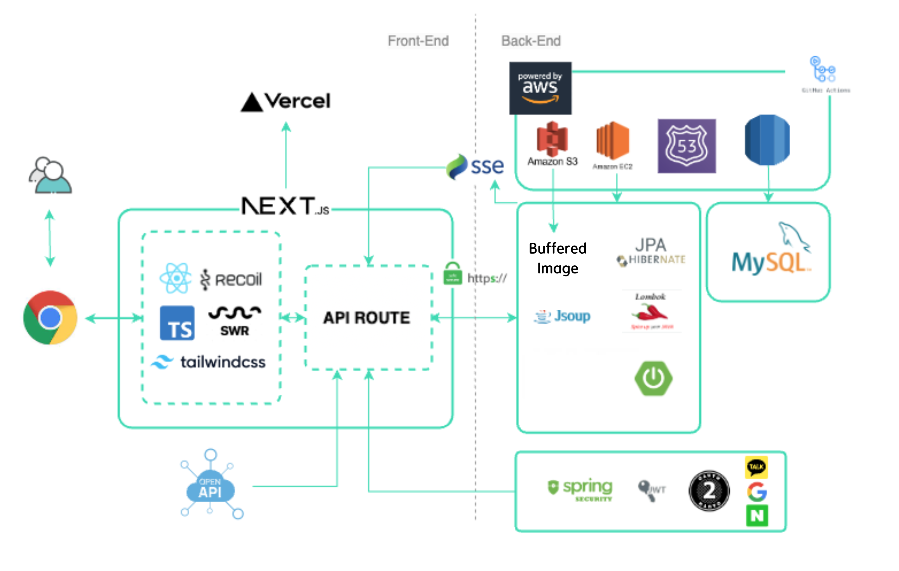

# Seoulvival

#### FE: 최은석, 강신범, 김나영

#### BE: 이채원, 김정빈

 

# 🛍️Table Of Contents

- <a href='https://seoulvival.com/'>홈페이지 주소</a>
- <a href='https://www.notion.so/SEOULVIVAL-392b247478d740ef82a1adca716b8a19'>프로젝트 브로셔</a>
- <a href=''>발표 영상</a>
- <a href='https://www.youtube.com/watch?v=UyvLrOI85wQ'>시연 영상</a>

 
 

# 📅 프로젝트 기간

- 2023년 7월 28일 ~ 9월 7일

 
 

# 기술 스택

 
 
 
  
 
  
  
 
 

 
 

# 💻 주요 기능 및 멤버 역할

### <a href="https://github.com/nonjk2">최은석</a>

**역할:**

- 공통부분
  - SWRconfigProvider, SSEProvider, RecoilProvider, ToastProvider 설계
  - BottomSheet 제작
  - Token 인증 method 제작
  - Metadata 작성 (SEO 최적화)
- 홈페이지
  - 페이지UI
  - 반응형 기상날씨 조회 구현
  - 캐러셀, 모듈화 된 postItem
  - 맵을 이용한 가시적 위치정보 제공 기능
  - 인구밀집현황 모달 및 기능 구현
- 커뮤니티 페이지
  - 커뮤니티 페이지 UI
  - infinity scroll 기능을 통한 게시물 조회
- 알림 기능
  - 알림 UI
  - SSE를 통한 알림기능 구현
     

### <a href="https://github.com/kangsinbeom">강신범</a>

**역할:**

- 공통부분
  - response Type 지정
- 로그인
  - 일반 회원가입, 로그인 및 소셜로그인(카카오, 네이버 구글) 구현
  - JWT(Access Token, Refresh Token)를 통한 사용자 관리
  - react-hook-form 을 사용한 입력창 구현
- 디테일 페이지
  - 게시글 UI
  - 댓글, 대댓글 반응형 구현
  - 댓글 CRUD 기능구현
  - MetaData 작성 (반응형)
- 마이페이지
  - 유저 정보 조회, 가입 추가사항 등록, 닉네임 변경 및 유저 이미지 변경, 회원 탈퇴 및 로그아웃 기능
- middleware를 사용한 route관리
- Vercel 배포 및 관리
   

### <a href='https://github.com/nayoung3669'>김나영</a>

**역할:**

- 공통부분
  - hooks 관리
  - request Type 지정
  - modalPortal 모듈화 및 기능 구현
- 맵
  - 게시물 정보 기반 marker 생성
  - 유저의 현재위치 이동 기능
  - filter를 통한 게시물 조회
  - 이동 시 지역 polygon 기반 현재 맵 위치 시각화
- 게시글 작성 페이지
  - 위치 기반 및 이미지 첨부 게시글 작성 기능
  - 맵 기반 위치 조회 및 저장 기능
  - 게시글 작성 페이지 UI
- 홈페이지

  - 서울시 정책정보 Open API 활용 기능 구현
  - 앱 Navigation Bar 제작

- 검색 기능

  - 검색기능 UI
  - 위치 검색 기능 구현

   

# 아키텍쳐

 
 

# 주요 트러블 슈팅

## Lazy Loading

1. 문제 상황 : 서울시 전체의 데이터를 한번에 가져옴
   -> 유저에게 최신의 데이터를 다양하게 보여주기 어려울뿐만 아니라 클라이언트 서버 과부하 우려
2. 해결 : Lazy Loading 도입

   1. 유저가 지도의 "구" 단위의 특정 부분(송파구, 강남구 ...)에 접근하면 맵 센터의 위도와 경도 정보를 저장합니다.
   2. 서울시 경계 좌표 Polygon을 이용해 해당하는 정보를 매칭합니다.
   3. 유저가 센터를 바꿀 때 마다 해당하는 구의 데이터의 정보만 가져와서 뿌려줍니다.

   
